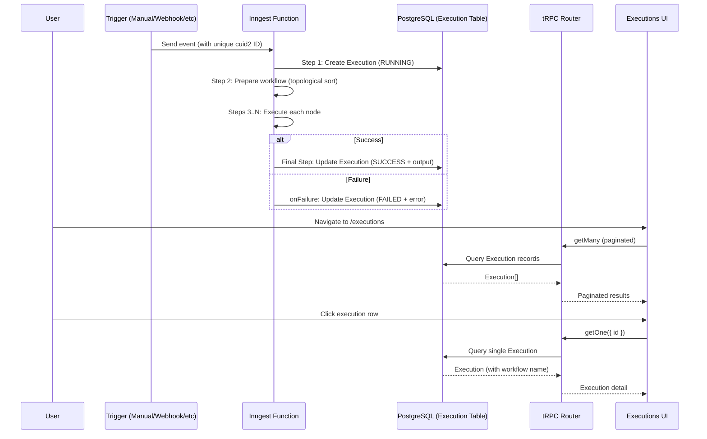
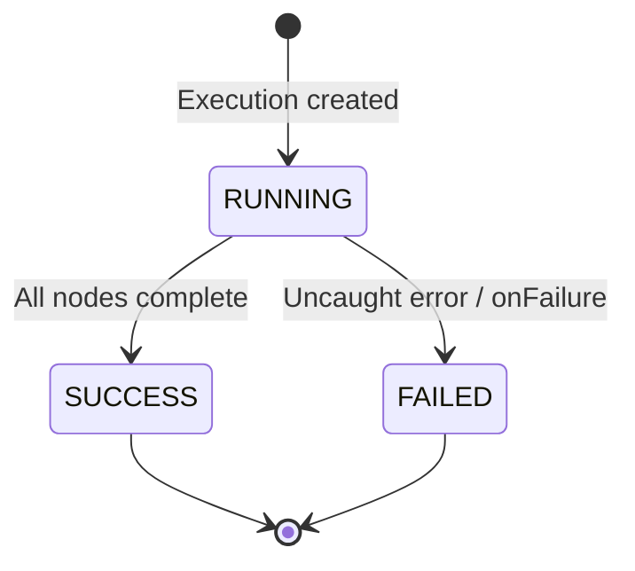

# Workflow Execution Tracking Spec

## Table of Contents
1. [Overview](#1-overview)
2. [Why This Feature is Needed](#2-why-this-feature-is-needed)
3. [Architecture & Data Flow](#3-architecture--data-flow)
4. [Schema & Data Models](#4-schema--data-models)
5. [Execution Lifecycle (Inngest)](#5-execution-lifecycle-inngest)
6. [Backend API (tRPC Router)](#6-backend-api-trpc-router)
7. [Client-Side Data Fetching](#7-client-side-data-fetching)
8. [URL State Management (Pagination)](#8-url-state-management-pagination)
9. [UI Components](#9-ui-components)
10. [Page Routing & Server-Side Rendering](#10-page-routing--server-side-rendering)
11. [Status Transitions & State Machine](#11-status-transitions--state-machine)
12. [Validation, Errors, and Edge Cases](#12-validation-errors-and-edge-cases)
13. [Dependencies](#13-dependencies)
14. [File Inventory](#14-file-inventory)
15. [Acceptance Criteria](#15-acceptance-criteria)
16. [Assumptions & Open Questions](#16-assumptions--open-questions)

---

## 1. Overview

The Workflow Execution Tracking feature in Orbitron introduces persistent, user-facing records for every workflow run. Whenever a workflow is executed (whether triggered manually, by a webhook, or any other trigger), the system automatically creates an `Execution` record that tracks the full lifecycle of that run—from initiation through success or failure.

Users can browse a paginated list of all their past executions at `/executions`, drill into any individual execution at `/executions/[executionId]` to inspect its status, timing, error details, stack traces, and final output.

This feature transforms Orbitron from a "fire-and-forget" workflow engine into a fully observable automation platform where users have complete visibility into what happened during each execution.

---

## 2. Why This Feature is Needed

Prior to this feature, Orbitron had no persistent record of workflow executions. When a user triggered a workflow:

- There was no history of past runs.
- There was no way to determine if a run succeeded, failed, or was still in progress.
- There was no mechanism to inspect error messages or stack traces from failed runs.
- There was no way to view the final output of a completed run.
- Debugging workflow issues required inspecting the Inngest dashboard directly.

This feature closes that observability gap by introducing a first-class `Execution` model that provides a user-facing audit trail for every workflow run.

---

## 3. Architecture & Data Flow

The feature spans three architectural layers: **database persistence**, **Inngest function lifecycle**, and **full-stack UI rendering**.

### High-Level Flow



### Key Design Decisions

1. **Event ID Correlation**: Each Inngest event is given a unique `cuid2` identifier at send-time. This ID is stored as `inngestEventId` on the Execution record, creating a durable 1:1 link between the Inngest event and the database record. This is critical for the `onFailure` handler, which receives only the original event data (not the execution ID) and must locate the execution to update.

2. **Inngest Step Isolation**: The execution record is created and updated inside dedicated `step.run()` blocks (`create-execution` and `update-execution`). This ensures that these database writes are memoized by Inngest and will not be re-executed on function retries.

3. **Server-Side Prefetching**: Both pages use Next.js Server Components to prefetch data via tRPC before the page renders. The data is hydrated into the client via `<HydrateClient>`, providing instant page loads without loading spinners on the initial render.

---

## 4. Schema & Data Models

### 4.1 ExecutionStatus Enum

File: `prisma/schema.prisma`

```prisma
enum ExecutionStatus {
  RUNNING
  SUCCESS
  FAILED
}
```

- **RUNNING**: The workflow execution has started but has not completed yet.
- **SUCCESS**: All nodes executed successfully and the final output was captured.
- **FAILED**: An unrecoverable error occurred during execution, captured by the Inngest `onFailure` handler.

### 4.2 Execution Model

File: `prisma/schema.prisma`

```prisma
model Execution {
  id String @id @default(cuid())

  workflowId String
  workflow   Workflow @relation(fields: [workflowId], references: [id], onDelete: Cascade)

  status     ExecutionStatus @default(RUNNING)
  error      String?         @db.Text
  errorStack String?         @db.Text

  startedAt   DateTime @default(now())
  completedAt DateTime?

  inngestEventId String @unique

  output Json?
}
```

| Field | Type | Description |
|---|---|---|
| `id` | `String (cuid)` | Primary key, auto-generated. |
| `workflowId` | `String` | Foreign key to the Workflow that was executed. Cascade-deletes when workflow is deleted. |
| `status` | `ExecutionStatus` | Current state of the execution. Defaults to `RUNNING` on creation. |
| `error` | `String? (Text)` | Human-readable error message. Populated only when `status = FAILED`. |
| `errorStack` | `String? (Text)` | Full JavaScript stack trace. Populated only when `status = FAILED`. |
| `startedAt` | `DateTime` | Timestamp when the execution record was created. Defaults to `now()`. |
| `completedAt` | `DateTime?` | Timestamp when the execution finished. `null` while `RUNNING`. Set when `status` transitions to `SUCCESS`. |
| `inngestEventId` | `String (unique)` | The cuid2 ID assigned to the Inngest event at send-time. Used by the `onFailure` handler to locate this record. Unique constraint ensures no duplicate executions per event. |
| `output` | `Json?` | The final workflow context after all nodes have executed. Stored as JSONB. `null` while `RUNNING` or when `FAILED`. |

### 4.3 Workflow Model Update

The `Workflow` model gained an `executions` relation:

```prisma
model Workflow {
  // ... existing fields ...
  executions  Execution[]
  // ...
}
```

This enables cascading deletion (deleting a workflow deletes all its execution records) and scoped queries (querying executions via `workflow.userId` for authorization).

### 4.4 Migration

File: `prisma/migrations/20260821_executions_schema/migration.sql`

The migration performs three operations:
1. Creates the `ExecutionStatus` PostgreSQL enum type.
2. Creates the `Execution` table with all columns and constraints.
3. Creates a unique index on `inngestEventId` and a foreign key constraint from `workflowId` to `Workflow(id)` with `ON DELETE CASCADE`.

---

## 5. Execution Lifecycle (Inngest)

### 5.1 Event Dispatch

File: `src/inngest/utils.ts`

The `sendWorkflowExecution()` function is the single entry point for triggering workflow executions. It now assigns a unique `cuid2` identifier to every event:

```typescript
import { createId } from "@paralleldrive/cuid2"

export const sendWorkflowExecution = (data: {
    workflowId: string;
    [key: string]: unknown;
}) => {
    return inngest.send({
        name: "workflows/execute.workflow",
        data,
        id: createId(), // ← Used as inngestEventId in the Execution record
    });
};
```

The `id` field on the Inngest event becomes `event.id` inside the function handler, which is then stored as `inngestEventId` in the database.

### 5.2 Function Handler

File: `src/inngest/function.ts`

The `executeWorkflow` Inngest function follows Orbitron's v4 two-argument `createFunction` pattern. The execution lifecycle is structured as three distinct phases:

#### Phase 1: Create Execution Record

```typescript
await step.run("create-execution", async () => {
  return prisma.execution.create({
    data: {
      workflowId,
      inngestEventId,
    },
  });
});
```

- Creates a new `Execution` record with `status = RUNNING` (the Prisma default).
- Runs as an Inngest step for durability—will not re-execute on retry.

#### Phase 2: Execute Workflow Nodes

The existing workflow execution logic remains unchanged: topological sort, context initialization, sequential node execution. Each node executor receives the accumulated context and produces a modified context for the next node.

#### Phase 3: Mark Success

```typescript
await step.run("update-execution", async () => {
  return prisma.execution.update({
    where: { inngestEventId, workflowId },
    data: {
      status: ExecutionStatus.SUCCESS,
      completedAt: new Date(),
      output: context,
    },
  });
});
```

- Transitions the execution to `SUCCESS`.
- Records the `completedAt` timestamp for duration calculation.
- Saves the final workflow `context` as `output` (JSONB).

### 5.3 Failure Handler

```typescript
onFailure: async ({ event }) => {
  return prisma.execution.update({
    where: { inngestEventId: event.data.event.id },
    data: {
      status: ExecutionStatus.FAILED,
      error: event.data.error.message,
      errorStack: event.data.error.stack,
    },
  });
},
```

- The `onFailure` hook is invoked by Inngest whenever the function handler throws an uncaught error or exhausts all retries.
- It locates the execution record via the original event's `id` (which maps to `inngestEventId`).
- It persists the error message and full stack trace for debugging.
- **Important**: `onFailure` does NOT set `completedAt`. A failed execution will have `completedAt = null`. This is intentional—it distinguishes "completed successfully" from "terminated due to error."

### 5.4 Guard Check

Before any steps execute, the handler validates that both `event.id` and `event.data.workflowId` are present:

```typescript
if (!inngestEventId || !workflowId) {
  throw new NonRetriableError("Event ID or workflow ID is missing");
}
```

This prevents orphaned execution records from malformed events.

---

## 6. Backend API (tRPC Router)

File: `src/features/executions/server/routers.ts`

The `executionsRouter` exposes two read-only procedures. Both are `protectedProcedure` (require authentication) and scope all queries to the authenticated user via `workflow.userId`.

### 6.1 `getOne`

Fetches a single execution by ID, including the associated workflow's `id` and `name`.

```typescript
getOne: protectedProcedure
  .input(z.object({ id: z.string() }))
  .query(({ ctx, input }) => {
    return prisma.execution.findUniqueOrThrow({
      where: {
        id: input.id,
        workflow: { userId: ctx.auth.user.id },
      },
      include: {
        workflow: { select: { id: true, name: true } },
      },
    });
  }),
```

- **Authorization**: The `workflow.userId` constraint ensures users can only access their own executions.
- **Error Behavior**: Throws a Prisma `NotFoundError` if the execution does not exist or belongs to another user.

### 6.2 `getMany`

Fetches a paginated list of executions, ordered by most recent first.

```typescript
getMany: protectedProcedure
  .input(z.object({
    page: z.number().default(PAGINATION.DEFAULT_PAGE),
    pageSize: z.number()
      .min(PAGINATION.MIN_PAGE_SIZE)
      .max(PAGINATION.MAX_PAGE_SIZE)
      .default(PAGINATION.DEFAULT_PAGE_SIZE),
  }))
```

**Response shape**:

```typescript
{
  items: Execution[],      // The page of execution records (with workflow name/id)
  page: number,            // Current page number
  pageSize: number,        // Items per page
  totalCount: number,      // Total number of executions
  totalPages: number,      // Computed from totalCount / pageSize
  hasNextPage: boolean,
  hasPreviousPage: boolean,
}
```

- **Ordering**: Results are always sorted by `startedAt: "desc"` (newest first).
- **Pagination Constants**: Uses `PAGINATION.DEFAULT_PAGE` (1), `PAGINATION.DEFAULT_PAGE_SIZE` (5), `PAGINATION.MIN_PAGE_SIZE` (1), `PAGINATION.MAX_PAGE_SIZE` (100) from `src/config/constants.ts`.

### 6.3 Router Registration

File: `src/trpc/routers/_app.ts`

The `executionsRouter` is registered in the global tRPC app router:

```typescript
export const appRouter = createTRPCRouter({
  workflows: workflowsRouter,
  credentials: credentialsRouter,
  executions: executionsRouter,
});
```

---

## 7. Client-Side Data Fetching

### 7.1 Suspense Hooks

File: `src/features/executions/hooks/use-executions.ts`

Two React hooks provide data access from client components using TanStack Query's suspense mode:

```typescript
export const useSuspenseExecutions = () => {
  const trpc = useTRPC();
  const [params] = useExecutionsParams();
  return useSuspenseQuery(trpc.executions.getMany.queryOptions(params));
};

export const useSuspenseExecution = (id: string) => {
  const trpc = useTRPC();
  return useSuspenseQuery(trpc.executions.getOne.queryOptions({ id }));
};
```

- `useSuspenseExecutions()`: Used by the executions list page. Automatically reads the current pagination params from the URL via `useExecutionsParams`.
- `useSuspenseExecution(id)`: Used by the execution detail page. Takes a specific execution ID.
- Both hooks use `useSuspenseQuery`, which suspends the component until data is available. This integrates with the `<Suspense>` boundary in the page layout to show a loading state.

### 7.2 Server-Side Prefetching

File: `src/features/executions/server/prefetch.ts`

Two helpers prefetch data on the server before the page renders:

```typescript
export const prefetchExecutions = (params: Input) => {
  return prefetch(trpc.executions.getMany.queryOptions(params));
};

export const prefetchExecution = (id: string) => {
  return prefetch(trpc.executions.getOne.queryOptions({ id }));
};
```

These are called from Next.js Server Components. The prefetched data is dehydrated into the HTML response via `<HydrateClient>`, so the client-side `useSuspenseQuery` hooks resolve immediately without a network request.

---

## 8. URL State Management (Pagination)

### 8.1 Parameter Definitions

File: `src/features/executions/params.ts`

```typescript
export const executionsParams = {
  page: parseAsInteger
    .withDefault(PAGINATION.DEFAULT_PAGE)
    .withOptions({ clearOnDefault: true }),
  pageSize: parseAsInteger
    .withDefault(PAGINATION.DEFAULT_PAGE_SIZE)
    .withOptions({ clearOnDefault: true }),
};
```

- Uses `nuqs` for type-safe URL search parameter management.
- `clearOnDefault: true` ensures default values (page 1, pageSize 5) do not clutter the URL.

### 8.2 Server Loader

File: `src/features/executions/server/params-loader.ts`

```typescript
export const executionsParamsLoader = createLoader(executionsParams);
```

A `nuqs/server` loader that parses `searchParams` from the Next.js page props on the server side.

### 8.3 Client Hook

File: `src/features/executions/hooks/use-executions-params.ts`

```typescript
export const useExecutionsParams = () => {
  return useQueryStates(executionsParams);
};
```

Provides `[params, setParams]` on the client side. When `setParams` is called (e.g., from the pagination controls), the URL is updated and the TanStack Query re-fetches automatically.

---

## 9. UI Components

### 9.1 Executions List Components

File: `src/features/executions/components/executions.tsx`

This file exports seven components that compose the executions list page:

| Component | Responsibility |
|---|---|
| `ExecutionsList` | Renders the list of `ExecutionItem` components using `EntityList`. Shows `ExecutionsEmpty` when there are no records. |
| `ExecutionsHeader` | Renders the page header: "Executions" title with "View your workflow execution history" description. No "New" button (executions are created automatically). |
| `ExecutionsPagination` | Renders Prev/Next pagination controls. Disables buttons while fetching. Updates URL params on page change. |
| `ExecutionsContainer` | Wraps children with `EntityContainer`, providing header and pagination layout. |
| `ExecutionsLoading` | Suspense fallback. Displays a spinner with "Loading executions..." |
| `ExecutionsError` | ErrorBoundary fallback. Displays an alert icon with "Error loading executions". |
| `ExecutionsEmpty` | Empty state. Displays "You haven't created any executions yet. Get started by running your first workflow". |

#### `ExecutionItem`

Renders a single execution row in the list as a clickable card:

- **Image**: A status icon (green checkmark for SUCCESS, red X for FAILED, spinning blue loader for RUNNING).
- **Title**: The execution status formatted as "Running", "Success", or "Failed".
- **Subtitle**: `{workflow name} • Started {relative time} • Took {duration}s` (duration shown only for completed executions).
- **Navigation**: Clicking the item navigates to `/executions/{id}`.

#### Status Icon Mapping

| Status | Icon | Color |
|---|---|---|
| `SUCCESS` | `CheckCircle2Icon` | `text-green-600` |
| `FAILED` | `XCircleIcon` | `text-red-600` |
| `RUNNING` | `Loader2Icon` (animated spin) | `text-blue-600` |
| Unknown | `ClockIcon` | `text-muted-foreground` |

### 9.2 Execution Detail Component

File: `src/features/executions/components/execution.tsx`

The `ExecutionView` component renders a comprehensive detail card for a single execution:

#### Header Section
- Status icon + formatted status ("Running", "Success", "Failed")
- Description: "Execution for {workflow name}"

#### Detail Grid (2-column layout)
| Field | Value |
|---|---|
| Workflow | Clickable link to `/workflows/{workflowId}` |
| Status | Formatted status string |
| Started | Relative time (e.g., "5 minutes ago") via `date-fns` |
| Completed | Relative time (shown only if `completedAt` is set) |
| Duration | Computed `completedAt - startedAt` in seconds (shown only if completed) |
| Event ID | The raw `inngestEventId` string |

#### Error Section (conditional)
Shown only when `execution.error` is non-null:
- Red background panel (`bg-red-50`)
- Error message in monospace font
- **Collapsible stack trace**: Uses `@radix-ui/react-collapsible` to show/hide the full `errorStack`. Toggle button reads "Show stack trace" / "Hide stack trace".

#### Output Section (conditional)
Shown only when `execution.output` is non-null:
- Muted background panel (`bg-muted`)
- Pretty-printed JSON output (`JSON.stringify(output, null, 2)`) in monospace font.

### 9.3 Collapsible UI Primitive

File: `src/components/ui/collapsible.tsx`

A thin wrapper around `@radix-ui/react-collapsible` following Orbitron's existing shadcn/ui component pattern:

```typescript
export { Collapsible, CollapsibleTrigger, CollapsibleContent };
```

---

## 10. Page Routing & Server-Side Rendering

### 10.1 Executions List Page

File: `src/app/(dashboard)/(rest)/executions/page.tsx`

```
Route: /executions
Auth: requireAuth()
```

1. Parses `searchParams` for pagination (`page`, `pageSize`) using `executionsParamsLoader`.
2. Prefetches the paginated executions list via `prefetchExecutions(params)`.
3. Renders `<ExecutionsContainer>` wrapping `<HydrateClient>` → `<ErrorBoundary>` → `<Suspense>` → `<ExecutionsList>`.

### 10.2 Execution Detail Page

File: `src/app/(dashboard)/(rest)/executions/[executionId]/page.tsx`

```
Route: /executions/[executionId]
Auth: requireAuth()
```

1. Extracts `executionId` from the route params.
2. Prefetches the single execution via `prefetchExecution(executionId)`.
3. Renders a centered, max-width container wrapping `<HydrateClient>` → `<ErrorBoundary>` → `<Suspense>` → `<ExecutionView>`.

### Both pages share these patterns:
- `requireAuth()` server-side guard (redirects unauthenticated users).
- Server-side tRPC prefetching for instant hydrated rendering.
- `<ErrorBoundary>` wrapping with `<ExecutionsError />` fallback.
- `<Suspense>` wrapping with `<ExecutionsLoading />` fallback.

---

## 11. Status Transitions & State Machine

The execution lifecycle follows a strict state machine:



**Rules:**
- An execution always starts in `RUNNING` (Prisma default).
- Only `RUNNING → SUCCESS` and `RUNNING → FAILED` transitions are valid.
- `SUCCESS` and `FAILED` are terminal states—no further transitions occur.
- `completedAt` is set only on `SUCCESS`. Failed executions have `completedAt = null`.
- `error` and `errorStack` are set only on `FAILED`.
- `output` is set only on `SUCCESS`.

---

## 12. Validation, Errors, and Edge Cases

### Event Validation
- If `event.id` or `event.data.workflowId` is missing, the handler throws a `NonRetriableError` immediately. No execution record is created because the `create-execution` step has not run yet.

### Authorization
- All tRPC queries scope to `workflow.userId = ctx.auth.user.id`. Users cannot see executions for workflows they do not own.
- `getOne` uses `findUniqueOrThrow`, which returns a Prisma error (mapped to a tRPC error) if the execution does not exist or belongs to another user.

### Cascade Deletion
- Deleting a `Workflow` cascades to delete all its `Execution` records (`onDelete: Cascade` on the Prisma relation). This prevents orphaned execution records.

### Unique Constraint on `inngestEventId`
- The `@unique` constraint on `inngestEventId` prevents duplicate execution records for the same Inngest event. If `inngest.send()` is accidentally called with the same ID twice, the `create-execution` step will throw a Prisma unique constraint violation, which Inngest will treat as an error.

### Pagination Edge Cases
- `pageSize` is validated with `min(1)` and `max(100)` to prevent abuse.
- If `page` exceeds the total pages, an empty `items` array is returned with `totalPages` and `totalCount` reflecting the actual data.

### Long-Running Executions
- Executions that are still in `RUNNING` state will appear in the list with an animated spinner icon. They will remain in `RUNNING` state until the Inngest function completes or the `onFailure` handler runs.

---

## 13. Dependencies

| Package | Version | Purpose | Status |
|---|---|---|---|
| `@radix-ui/react-collapsible` | `^1.1.20` | Collapsible UI primitive for stack trace toggle | **Newly added** |
| `@paralleldrive/cuid2` | `^3.0.6` | Unique event ID generation | Already installed |
| `date-fns` | `^4.1.0` | Relative time formatting (`formatDistanceToNow`) | Already installed |
| `nuqs` | `^2.8.6` | Type-safe URL search parameter management | Already installed |
| `react-error-boundary` | `^6.0.0` | Error boundary for React Suspense | Already installed |
| `lucide-react` | `^0.552.0` | Status icons (CheckCircle2, XCircle, Loader2, Clock) | Already installed |

---

## 14. File Inventory

### Modified Files

| File | Change Summary |
|---|---|
| `package.json` | Added `@radix-ui/react-collapsible` dependency |
| `prisma/schema.prisma` | Added `ExecutionStatus` enum, `Execution` model, `executions` relation on `Workflow` |
| `src/inngest/function.ts` | Added `onFailure` handler, `create-execution` step, `update-execution` step, event ID validation |
| `src/inngest/utils.ts` | Added `createId()` import and `id: createId()` to `inngest.send()` |
| `src/trpc/routers/_app.ts` | Registered `executionsRouter` |
| `src/app/(dashboard)/(rest)/executions/page.tsx` | Replaced placeholder with full executions list page |
| `src/app/(dashboard)/(rest)/executions/[executionId]/page.tsx` | Replaced placeholder with full execution detail page |

### New Files

| File | Purpose |
|---|---|
| `prisma/migrations/20260821_executions_schema/migration.sql` | SQL migration for Execution table and ExecutionStatus enum |
| `src/components/ui/collapsible.tsx` | Radix Collapsible UI primitive |
| `src/features/executions/params.ts` | nuqs pagination parameter definitions |
| `src/features/executions/server/routers.ts` | tRPC router with `getOne` and `getMany` procedures |
| `src/features/executions/server/params-loader.ts` | Server-side nuqs parameter loader |
| `src/features/executions/server/prefetch.ts` | Server-side tRPC prefetch helpers |
| `src/features/executions/hooks/use-executions.ts` | React suspense query hooks |
| `src/features/executions/hooks/use-executions-params.ts` | React hook for URL pagination state |
| `src/features/executions/components/executions.tsx` | Executions list page UI components |
| `src/features/executions/components/execution.tsx` | Single execution detail view component |

---

## 15. Acceptance Criteria

### Database
- [ ] The `ExecutionStatus` enum exists in PostgreSQL with values `RUNNING`, `SUCCESS`, `FAILED`.
- [ ] The `Execution` table exists with all specified columns and constraints.
- [ ] The `inngestEventId` column has a unique index.
- [ ] Deleting a workflow cascades to delete all its executions.

### Execution Lifecycle
- [ ] When a workflow is triggered, a new `Execution` record is created with `status = RUNNING`.
- [ ] Each Inngest event receives a unique `cuid2` identifier stored as `inngestEventId`.
- [ ] On successful completion, the execution transitions to `SUCCESS` with `completedAt` and `output` populated.
- [ ] On failure, the `onFailure` handler transitions the execution to `FAILED` with `error` and `errorStack` populated.
- [ ] Missing `event.id` or `workflowId` immediately throws `NonRetriableError` without creating a record.

### Executions List Page (`/executions`)
- [ ] Page is protected by authentication.
- [ ] Displays a paginated list of the current user's executions, ordered by newest first.
- [ ] Each item shows status icon, status text, workflow name, start time, and duration (if completed).
- [ ] Clicking an item navigates to the execution detail page.
- [ ] Pagination controls navigate between pages via URL search params.
- [ ] Empty state is shown when no executions exist.
- [ ] Error boundary is shown when data fetching fails.
- [ ] Loading state is shown while data is being fetched.

### Execution Detail Page (`/executions/[executionId]`)
- [ ] Page is protected by authentication.
- [ ] Displays the execution's status, workflow (as a link), start time, completion time, duration, and event ID.
- [ ] For failed executions, displays the error message and a collapsible stack trace.
- [ ] For successful executions, displays the output as pretty-printed JSON.
- [ ] Error boundary and loading state are properly handled.

### Authorization
- [ ] Users can only see their own executions (scoped via `workflow.userId`).
- [ ] Attempting to access another user's execution returns an error.

---

## 16. Assumptions & Open Questions

- **No Deletion/Retry UI**: The current implementation is read-only. Users cannot delete individual execution records or retry failed executions from the UI. These could be added in future iterations.
- **No Real-Time Updates**: The executions list does not auto-refresh when new executions complete. A user must manually refresh or navigate away and back. A future enhancement could use Inngest Realtime or polling to update the list in real-time.
- **`completedAt` on Failure**: Failed executions do not have a `completedAt` timestamp. If duration tracking for failed executions is needed, the `onFailure` handler should be updated to set `completedAt: new Date()`.
- **Output Size**: The `output` field stores the entire workflow context as JSONB. For workflows with very large outputs, this could grow significantly. Consider adding output size limits or truncation in production.
- **Retry Count**: The Inngest function currently has `retries: 0` (marked as a TODO for production). When retries are enabled, the `onFailure` handler will only fire after all retries are exhausted, not after each individual failure.
