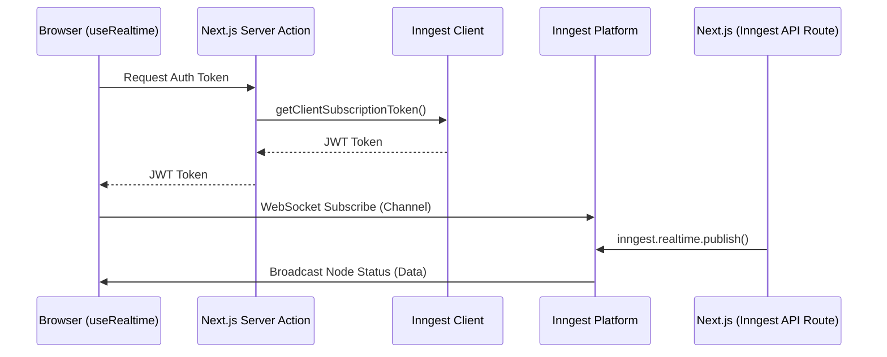

# Orbitron Realtime Architecture (Inngest v4)

## Table of Contents
1. [Overview](#1-overview)
2. [Why We Migrated](#2-why-we-migrated)
3. [Complete API Comparison](#3-complete-api-comparison)
4. [Repository Audit](#4-repository-audit)
5. [Channel Architecture](#5-channel-architecture)
6. [Publishing Flow](#6-publishing-flow)
7. [Function Registration](#7-function-registration)
8. [TypeScript Changes](#8-typescript-changes)
9. [Migration Checklist](#9-migration-checklist)
10. [Common Errors](#10-common-errors)
11. [Best Practices](#11-best-practices)
12. [Anti-patterns](#12-anti-patterns)
13. [Troubleshooting Guide](#13-troubleshooting-guide)
14. [Testing](#14-testing)
15. [Future Development Guide](#15-future-development-guide)
16. [Frequently Asked Questions](#16-frequently-asked-questions)
17. [Lessons Learned](#17-lessons-learned)

---

## 1. Overview

Inngest Realtime provides the mechanism for pushing high-frequency, bidirectional events directly from serverless functions to the browser via WebSockets. 

In Orbitron, Realtime is used for **Workflow Node Execution Updates**. When a workflow executes, each node (e.g., HTTP Request, Manual Trigger) takes time to run. We use Realtime to stream the precise status of each node (e.g., `loading`, `success`, `error`) directly to the canvas UI so the user experiences immediate visual feedback.

### High-level Architecture



---

## 2. Why We Migrated

We migrated from Inngest Realtime v3 (`@inngest/realtime`) to Inngest v4 for several critical reasons:

- **Deprecated Standalone Package:** `@inngest/realtime` is officially deprecated. Realtime functionality has been merged directly into the core `inngest` package.
- **Architectural Simplification:** In v3, we had to configure `realtimeMiddleware` on the client and explicitly register `channels: [channel1, channel2]` inside `createFunction`. In v4, channels are natively recognized without middleware or function-level registration.
- **Type Safety Improvements:** v4 introduces `realtime.channel()` which enforces strictly typed `topics` via Zod. This guarantees that publishers and subscribers strictly adhere to the same schema.
- **Client-Side Module Bleeding:** Previous abstractions encouraged putting channel constants and definitions in the same file, causing `node:async_hooks` module resolution errors when Next.js attempted to bundle server SDKs for the browser.

---

## 3. Complete API Comparison

| v3 (`@inngest/realtime`) | v4 (`inngest`) |
|--------------------------|----------------|
| `import { channel } from "@inngest/realtime"` | `import { realtime } from "inngest"` |
| `channel({ name, topics: [topic("status")] })` | `realtime.channel({ name, topics: { status: { schema: z.object(...) } } })` |
| `inngest.createFunction({ channels: [myChannel] })` | `inngest.createFunction(...)` *(channels array removed)* |
| `import { realtimeMiddleware } from "@inngest/realtime"` | **Removed completely** |
| `import { useInngestSubscription } from "@inngest/realtime/react"` | `import { useRealtime } from "inngest/react"` |
| `import { getSubscriptionToken } from "@inngest/realtime/react"` | `import { getClientSubscriptionToken } from "inngest/react"` |
| `step.publish(channel)` *(via middleware)* | `inngest.realtime.publish()` or `step.realtime.publish()` |
| `PublishFn` injected in handler | Removed. Use client directly. |

---

## 4. Repository Audit

The migration affected multiple layers of the application:

1. **`package.json`**: Upgraded `inngest` to `^4.13.0` and removed `@inngest/realtime`.
2. **`src/inngest/client.ts`**: Removed `realtimeMiddleware`.
3. **`src/inngest/channels/constants.ts`**: **[NEW]** Created to hold string literals for channel names (e.g., `HTTP_REQUEST_CHANNEL_NAME`). This prevents client components from importing files that contain the Inngest server SDK.
4. **`src/inngest/channels/*.ts`**: Rewritten to use `realtime.channel()` with Zod schemas. Imports names from `constants.ts`.
5. **`src/inngest/function.ts`**: Updated `createFunction` to the v4 2-argument signature. Removed `channels` configuration.
6. **`src/features/executions/types.ts`**: Removed `publish` from `NodeExecutorParams`. Executors now import `inngest` directly.
7. **`src/features/executions/components/*/executor.ts`**: Switched from `publish(channel.name, ...)` to `inngest.realtime.publish(channel.topics.status, ...)`.
8. **`src/features/executions/components/*/actions.ts`**: Updated token generation to use `getClientSubscriptionToken`.
9. **`src/features/executions/hooks/use-node-status.ts`**: Replaced `useInngestSubscription` with `useRealtime`.
10. **UI Nodes (`node.tsx`)**: Updated to import channel names purely from `constants.ts`.

---

## 5. Channel Architecture

Every channel in Orbitron represents a specific domain of updates (usually tied to a specific Node Type).

### Definition Pattern

Channels must be defined in `src/inngest/channels/` and must separate their string names into `constants.ts`.

```typescript
// src/inngest/channels/http-request.ts
import { realtime } from "inngest";
import { z } from "zod";
import { HTTP_REQUEST_CHANNEL_NAME } from "./constants";

export const httpRequestChannel = realtime.channel({
  name: HTTP_REQUEST_CHANNEL_NAME,
  topics: {
    status: {
      schema: z.object({
        nodeId: z.string(),
        status: z.enum(["loading", "success", "error"]),
      }),
    },
  },
});
```

* **Purpose**: Defines the contract for HTTP Request node updates.
* **Topic Definitions**: Topics are explicitly named keys (`status`) containing a Zod schema.
* **Payloads**: The payload guarantees a `nodeId` and a `status`.

---

## 6. Publishing Flow

Inngest v4 offers two ways to publish realtime events:

### 1. `inngest.realtime.publish()` (Non-Durable)
* **When to use**: Inside utility functions, executors, or server actions where you do not need Inngest's durable execution tracking (e.g., UI status updates that don't affect workflow state).
* **Usage in Orbitron**: We use this inside our `NodeExecutors`.

```typescript
import { inngest } from "@/inngest/client";
import { httpRequestChannel } from "@/inngest/channels/http-request";

await inngest.realtime.publish(httpRequestChannel.topics.status, {
  nodeId,
  status: "success",
});
```

### 2. `step.realtime.publish()` (Durable)
* **When to use**: Inside an Inngest function handler where the publish action must be durably recorded as a step in the workflow timeline.
* **Usage**: `await step.realtime.publish("my-step", channel.topics.status, { data })`

---

## 7. Function Registration

In v3, functions had to explicitly declare which channels they were allowed to publish to via `realtimeMiddleware` and the `channels` array.

In v4, **this requirement is completely removed.**

### Before (v3):
```typescript
export const executeWorkflow = inngest.createFunction(
  { id: "execute", channels: [httpRequestChannel] },
  { event: "workflow/run" },
  async ({ event, publish }) => {}
);
```

### After (v4):
```typescript
export const executeWorkflow = inngest.createFunction(
  { id: "execute" },
  async ({ event, step }) => {
    // channels array is gone.
    // publish is no longer in context.
  }
);
```

---

## 8. TypeScript Changes

v4 heavily relies on Zod for static type inference.

* **Payload Inference**: When calling `publish(topicRef, payload)`, TypeScript automatically infers the required shape of `payload` from the Zod schema defined in `topics`.
* **Compile-time validation**: If you attempt to publish `{ status: "pending" }` but the schema requires `"loading" | "success" | "error"`, TypeScript will throw an error at compile time.

---

## 9. Migration Checklist

If extending this system in the future, adhere to this architectural baseline established during the migration:

- [ ] Ensure `@inngest/realtime` is NOT in `package.json`.
- [ ] Define channel names in `src/inngest/channels/constants.ts`.
- [ ] Define channels using `realtime.channel()` with Zod schemas.
- [ ] Do NOT inject `channels` into `createFunction`.
- [ ] Use `getClientSubscriptionToken` for auth actions.
- [ ] Use `useRealtime` in React components.
- [ ] Do NOT import Inngest server instances into client components (`"use client"`).

---

## 10. Common Errors

### "has no call signatures"
**Why it happens**: In v3, `channel()` returned a callable function. Developers tried to invoke `channel(payload)`. In v4, `channel` returns a definition object.
* **Old**: `httpRequestChannel({ nodeId: "123" })`
* **Fix**: `inngest.realtime.publish(httpRequestChannel.topics.status, { nodeId: "123" })`

### `node:async_hooks` module build failed
**Why it happens**: A client component (`node.tsx`) imported `HTTP_REQUEST_CHANNEL_NAME` from `http-request.ts`. Because `http-request.ts` imports `inngest`, Webpack tried to bundle the server SDK into the browser.
* **Fix**: Isolate string exports into a `constants.ts` file that does not import anything. Client components only import from `constants.ts`.

---

## 11. Best Practices

1. **Constants Isolation**: ALWAYS put channel names in `constants.ts`. Never export strings from files that import server SDKs.
2. **Schema Strictness**: Use Zod `enum` for statuses instead of generic `string` to leverage TypeScript autocomplete.
3. **Executor Isolation**: Executors (`NodeExecutorParams`) should be self-contained and import `inngest` directly to publish updates, rather than relying on dependency injection from the Inngest handler.

---

## 12. Anti-patterns

* 🚫 **`realtimeMiddleware`**: Never add this to the Inngest client. It will break v4 functionality.
* 🚫 **Injecting `publish`**: Do not pass a `publish` function deeply through execution contexts. Just `import { inngest }` and publish directly.
* 🚫 **Client-side SDK imports**: Do not import `inngest` or channel definitions into `.tsx` client components.

---

## 13. Troubleshooting Guide

* **Build fails with `PageNotFoundError: Cannot find module for page: /_document`**
  * **Cause**: Next.js 15 Turbopack bug when using Sentry and App Router.
  * **Fix**: Ensure the build script is exactly `"build": "next build"`, omitting `--turbopack`.

* **Lint errors from `.next` during build**
  * **Cause**: Flat config `eslint.config.mjs` was improperly configured, causing Turbopack generated files to be linted.
  * **Fix**: Ensure the `ignores` block is the *absolute first* object in the `eslint.config.mjs` array, and keep `eslint: { ignoreDuringBuilds: true }` in `next.config.ts` as a failsafe.

---

## 14. Testing

To verify realtime functionality:
1. Ensure the project builds successfully (`pnpm run build`).
2. Run the development server (`pnpm dev`).
3. Open the canvas, drop an HTTP Request node, and click Execute.
4. Verify the node visually transitions through Loading → Success/Error states.
5. Check the browser Network tab for a WebSocket connection to `wss://realtime.inngest.com`.

---

## 15. Future Development Guide

**To add a new Realtime Channel:**
1. Add the string name to `src/inngest/channels/constants.ts`.
2. Create `src/inngest/channels/new-node.ts`.
3. Define the schema using `realtime.channel()`.
4. Create a token action in `actions.ts` using `getClientSubscriptionToken`.
5. Update the Node Executor to publish using `inngest.realtime.publish`.
6. Update the Node UI component to subscribe using `useNodeStatus` (which wraps `useRealtime`).

---

## 16. Frequently Asked Questions

**Why was realtimeMiddleware removed?**
Inngest native-ized Realtime. The client now inherently understands how to route realtime events without requiring explicit middleware or function-level registration.

**When should I use `step.realtime.publish()` over `inngest.realtime.publish()`?**
Use `step.realtime.publish()` only when the publish event is a critical, durable step in your workflow logic that must be retried upon failure. For pure UI updates (like our executor status ticks), use `inngest.realtime.publish()`.

---

## 17. Lessons Learned

* **Client/Server Boundaries**: Turbopack/Webpack are incredibly strict about server module usage in client components. The separation of constants is not just a nice-to-have; it is a strict requirement for Next.js App Router applications.
* **Ecosystem Volatility**: Migrating major versions of deeply integrated tools (Next.js 15, React 19, Inngest v4) simultaneously exposes cross-dependency bugs (like the Turbopack Sentry issue). Isolating variables during upgrades is critical.
